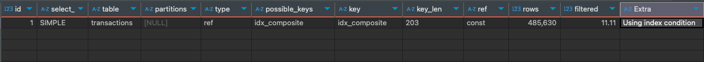
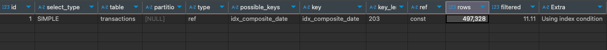
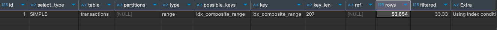

# Indexing, Cardinality and Composite Index Optimization Use Case


## Introduction 

Indexing is meant to make queries faster. But if done without understanding the data or the query patterns, it can do the opposite. In this post, I’ll walk through a real-world experience where a poorly optimized index on a table with around 500 million records caused daily reports to run painfully slow. The problem involved high cardinality in a timestamp column and how it interacted with a composite index. This case highlights why understanding cardinality, index structure, and query access patterns is critical for performance tuning.

---

## The Setup 

We had a table tracking transaction. Over 500 million rows, (haven't started the Archival process) each stamped with a created_at timestamp on MariaDb Database using InnoDb Engine. At the end of each day, users generate daily reports by querying this table based on the created_at date. Therefore, they had indexed the created_at column with other relevant column. 
This report generation nearly took around 30 minutes, and query itself took the majority of the time. To Follow along, lets imagine the following table with 1 million records: 

```sql
CREATE TABLE transactions (
    id INT AUTO_INCREMENT PRIMARY KEY,
    first_name VARCHAR(50),
    last_name VARCHAR(50),
    product_name VARCHAR(100),
    quantity INT,
    price DECIMAL(10, 2),
    region VARCHAR(50),
    payment_method VARCHAR(50),
    created_at DATETIME
);


CREATE INDEX idx_composite ON transactions (
    first_name, last_name, product_name, region, created_at
);
```

---

## The Debugging

The debugging began by analyzing the query execution plan using `EXPLAIN`, which revealed how the database was processing the query. This made it easier to identify inefficiencies related to indexing or query structure.

```sql
EXPLAIN SELECT * FROM transactions
WHERE first_name = 'Sarah' and created_at BETWEEN '2025-04-30' AND '2025-05-10';
```



This execution plan shows that the query is using the idx_composite index and benefits from index condition pushdown. However, the low filter ratio of 11.11% means it has to scan nearly half a million rows to return results. This suggests that while the index is technically used, it is not very selective or efficient for this query.
One of the first checks involved examining the cardinality of the index. Cardinality refers to the number of distinct values in a column. While high cardinality often improves index selectivity, it can also lead to inefficiencies depending on the query pattern. In this case, the indexed column was a `TIMESTAMP`, which naturally had very high cardinality.

Also, Executing the Query without any indexes or Cache, took less time than USING THE INDEX. for this we used `SQL_NO_CACHE` to disable query caching and `USE INDEX()` to force the query to use the index.

```sql
SELECT SQL_NO_CACHE * FROM transactions
USE INDEX (idx_composite_range)
WHERE first_name = 'Sarah' and created_at BETWEEN '2025-04-30' AND '2025-05-10'
```

---

## The Issue

Most relational databases, including MariaDB with the InnoDB engine, use B-tree (Balanced Tree) structures for indexing. These indexes maintain their entries in sorted order, which makes them efficient for range queries.
The way the BTree store the data in a single node depends on page size and key size of the indexing column. Each node in the B-Tree corresponds to a data page (typically 16KB in InnoDB), and within that page, multiple keys can be stored. The number of keys that can fit in a single node is determined by the size of each key (which includes the indexed column’s data, internal pointers, and metadata).
For example, if the page size is 16KB and you’re indexing a `TIMESTAMP` column (which typically requires 5–8 bytes), and assuming an additional overhead of approximately 6–12 bytes per entry, each index entry may average around 18 bytes in total. Based on this, a single B-Tree node can store approximately 900 keys (16,384 ÷ 18 ≈ 910), depending on exact metadata and storage format. 

For this table, the index was storing 500 million rows and used a composite index with created_at as the last column among five. If we imagine a node in a this B-tree index, it might have looked like this:
```
[
  ( 'Brown', 'Smith', 'ProductA', 30, '2025-04-28 10:00:00' ) -> row_pointer_1,
  ( 'Brown', 'Smith', 'ProductB', 35, '2025-04-28 11:30:00' ) -> row_pointer_2,
  ( 'Smith', 'Smith', 'ProductC', 28, '2025-04-29 09:00:00' ) -> row_pointer_3,
  ( 'Smith', 'Smith', 'ProductC', 32, '2025-04-29 09:00:00' ) -> row_pointer_4,
  ( 'Smith', 'Smith', 'ProductC', 25, '2025-04-29 12:00:00' ) -> row_pointer_5,
  ...
]
```

Since `created_at` is the last column, the B-tree index is primarily sorted by the first four columns (`column1`, `column2`, `column3`, `column4` in a general sense). Only when the values of these preceding four columns are identical will the index then be sorted by the `created_at` timestamp.

This structure poses a significant problem for queries that need to filter data based on a range of `created_at` values. To find all records within a specific time period, the database cannot simply perform an efficient range scan on the index. Instead, it would likely have to:

* Potentially scan a large portion (or even the entire) index: Because the `created_at` values are not the primary sorting key, they are scattered throughout the index based on the combinations of the first four columns.

* Increased I/O: The database would end up reading many index blocks that do not contain the desired `created_at` values, leading to increased disk I/O and slower query performance.

Because created_at is the last column in the index, range queries on it can’t use the index efficiently. This leads to broader scans and more I/O, which ultimately slows down the query as the data grows. To conclude, the root of the performance issue lies in both the order and size of the index. 

## The Solution

The solution we took at that time was to create a new column with only the date part of the timestamp, and then index that column. This certainly helped with the size of the B-tree, since it only takes 3 bytes to store a DATE instead of 5-8 bytes, which in turn reduced the depth of index B-Tree. As a result, the query became much more efficient and executed significantly faster. However The order of the index columns stayed the same and number of scanned rows didn't had much difference, as we can see on the following example, 

```sql
ALTER TABLE transactions
ADD COLUMN created_at_date DATE;

UPDATE transactions
SET created_at_date = DATE(created_at);

CREATE INDEX idx_composite_date ON transactions (
    first_name, last_name, product_name, region, created_at_date
);

EXPLAIN SELECT  *
FROM transactions
USE INDEX(idx_composite_date)
WHERE first_name = 'John' and created_at_date BETWEEN '2025-04-30' AND '2025-05-10';
```



If the order of the index columns were changed to place the created_at column first, the BTree would then be sorted primarily by timestamp. This could allow the database to perform much more efficient range scans for date-based queries. For example, a query like `WHERE created_at BETWEEN 'start' AND 'end'` might be able to quickly locate the relevant range with minimal I/O, resulting in faster execution. Since this was a transactions table where most queries tend to be time based, this kind of index ordering could have provided noticeable performance gains. 
That said, changing the index order might impact other queries that rely on the original leading columns, so it’s a tradeoff depending on access patterns.

```sql
CREATE INDEX idx_composite_range ON transactions (
    created_at_date, first_name, last_name, product_name, region
);


EXPLAIN SELECT  *
FROM transactions
USE INDEX(idx_composite_range)
WHERE first_name = 'John' and created_at_date BETWEEN '2025-04-30' AND '2025-05-10';
```



---

## Conclusion

This experience underscored a crucial lesson: indexing is not just about creating indexes, but about creating the right indexes based on how your data is queried. In our case, the composite index included created_at as the last column, which made it nearly useless for date range filters a common pattern in reporting queries. Despite technically using the index, the database was forced to scan large portions of it, leading to significant performance issues due to poor selectivity and inefficient I/O.

We tried reducing index size by indexing a DATE column instead of DATETIME, which brought modest gains. However, it was only when we reordered the index to place the date column first that the database could fully leverage the B-tree structure for efficient range scans.

Ultimately, performance tuning isn’t just about adding indexes—it’s about aligning index structure and order with your query patterns and understanding how cardinality and B-tree layout affect execution. Getting it wrong can make your queries slower, not faster.


## References

- https://en.wikipedia.org/wiki/B-tree
- https://dev.mysql.com/doc/refman/8.4/en/innodb-physical-structure.html
- https://dev.mysql.com/doc/refman/8.4/en/glossary.html#glos_b_tree

```sql
-- Create Table
CREATE TABLE transactions (
    id INT AUTO_INCREMENT PRIMARY KEY,
    first_name VARCHAR(50),
    last_name VARCHAR(50),
    product_name VARCHAR(100),
    quantity INT,
    price DECIMAL(10, 2),
    region VARCHAR(50),
    payment_method VARCHAR(50),
    created_at DATETIME
);


-- Create Indexes
CREATE INDEX idx_composite ON transactions (
    first_name, last_name, product_name, region, created_at
);

CREATE INDEX idx_composite_range ON transactions (
    created_at, first_name, last_name, product_name, region
);

ALTER TABLE transactions
ADD COLUMN created_at_date DATE;

UPDATE transactions
SET created_at_date = DATE(created_at);

CREATE INDEX idx_composite_date ON transactions (
    created_at_date, first_name, last_name, product_name, region, 
);


-- Insert Transactions
INSERT INTO transactions (
    first_name, last_name, product_name, quantity, price, region, payment_method, created_at
)
SELECT 
    ELT(FLOOR(1 + (RAND() * 4)), 'John', 'Alice', 'Michael', 'Sarah'),
    ELT(FLOOR(1 + (RAND() * 4)), 'Smith', 'Johnson', 'Williams', 'Brown'),
    ELT(FLOOR(1 + (RAND() * 4)), 'Widget A', 'Widget B', 'Gadget C', 'Device D'),
    FLOOR(RAND() * 10) + 1,
    ROUND(RAND() * 100, 2),
    ELT(FLOOR(1 + (RAND() * 4)), 'North', 'South', 'East', 'West'),
    ELT(FLOOR(1 + (RAND() * 3)), 'Card', 'Cash', 'Bank Transfer'),
    NOW() - INTERVAL FLOOR(RAND() * 30) DAY
FROM 
    transaction
LIMIT 100000;

-- Explain Query Plan
EXPLAIN SELECT SQL_NO_CACHE *
FROM transactions
USE INDEX (idx_composite)
WHERE created_at BETWEEN '2025-04-30' AND '2025-10-31';
```