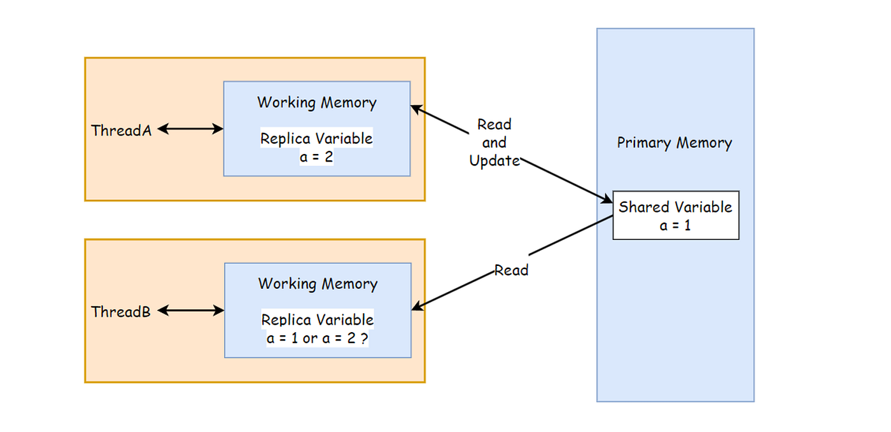
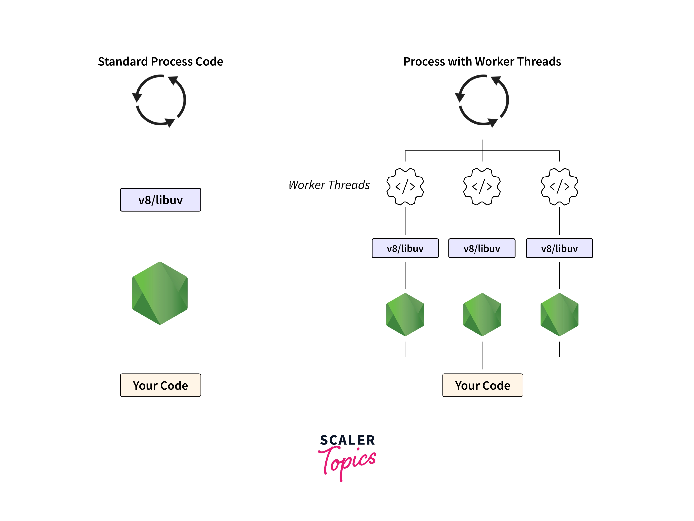

# ConcurrentHashMaps in Javascript

Answering, Why does not Javascript had `ConcurrentHashMap`, answers how Java and Javascript handles the concurrency, JavaScript is single-threaded, but you can still achieve concurrency and parallelism using Worker Threads and Child Processes. JavaScript does not need a mechanism like ConcurrentHashMap because of its Event Loop mechanics and the isolated memory model of Worker threads or Child processes.


## Concurrency in Java vs. JavaScript

Java is a multi-threaded language. It can run multiple threads at once, sharing memory and resources. This is great for performance but introduces problems like race conditions, deadlocks, and data corruption when threads try to access the same data at the same time.



To handle this, Java has implemented `java.util.concurrent.*` which has classes like ConcurrentHashMap, which allows safe, thread-safe access to shared data structures. 

--- 

JavaScript’s concurrency model, though single-threaded, is optimized for tasks like I/O operations, where the event loop allows non-blocking execution.  This keeps the main thread free and responsive, avoiding many of the problems Java’s multi-threading approach faces. There’s no need for something like ConcurrentHashMap because data isn’t being accessed by multiple threads at once in the first place.



## Requirement for Shared memory: Performance Between Threads

Shared memory allows threads within the same process to access and modify common data structures directly, eliminating the need for data copying or message passing. This direct access reduces latency and overhead, leading to faster communication between threads. 
When implementing true concurrency and parallelism in JavaScript, developers often rely on external mechanisms like Redis or database locks and status checks to prevent race conditions and thread contention. 


## ShareArrayBuffer & Atomics API

ECMAScript 2017 brought SharedArrayBuffer, a major enhancement that enables shared memory between threads, allowing true parallelism without the overhead of message-passing. This addition, combined with the Atomics API, allows developers to perform low-level, thread-safe operations directly on shared memory, reducing latency and improving throughput for data-intensive tasks.This capability is leveraged in real-time multiplayer games to synchronize game state across players, ensuring consistent and low-latency gameplay. It is also used in real-time audio processing applications to handle audio data in parallel, enabling features like live effects and synthesis. Furthermore, machine learning libraries like TensorFlow.js utilize SharedArrayBuffer to share large datasets between the main thread and Web Workers, enabling efficient model training and inference directly in the browser.


## ConcurrentHashMap Class Using SharedArrayBuffer and Atomics API

Using the SharedArrayBuffer and Atomics API, you can implement a ConcurrentHashMap-like structure like below. However, it may lead to performance issues compared to Java’s implementation. Java uses more advanced collision handling techniques, like segmented locking and fine-grained concurrency, which allow better scalability. In contrast, JavaScript’s collision resolution, often relying on methods like linear probing, can create contention and inefficiencies, particularly as the dataset grows. 

```js
// Should not be used. This just a example
class ConcurrentHashMap {
  constructor(size) {
    this.size = size;
    this.buffer = new SharedArrayBuffer(size * 8); // 8 bytes per entry (key + value)
    this.data = new BigUint64Array(this.buffer);
  }

  _hash(key) {
    return BigInt(key) % BigInt(this.size);
  }

  set(key, value) {
    const index = Number(this._hash(key));
    while (Atomics.compareExchange(this.data, index, BigInt(0), BigInt(value)) !== BigInt(0)) {
      // Retry if the slot is already occupied
    }
  }

  get(key) {
    const index = Number(this._hash(key));
    return Number(Atomics.load(this.data, index));
  }
}
```


## References

https://www.geeksforgeeks.org/concurrenthashmap-in-java/
https://developer.mozilla.org/en-US/docs/Web/JavaScript/Reference/Execution_model
https://www.tensorflow.org/js/tutorials/training/web_worker